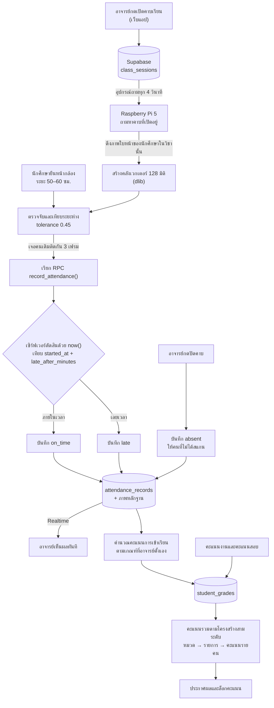

# SmartAttend

**ระบบตรวจสอบการเข้าเรียนอัตโนมัติด้วยการจดจำใบหน้า**
มหาวิทยาลัยเทคโนโลยีราชมงคลล้านนา เชียงใหม่

> SmartAttend records classroom attendance by recognising students' faces on a
> Raspberry Pi placed at the classroom door, while instructors manage sessions,
> assignments and a three-level grading scheme from a mobile-installable web app.
> Attendance status is decided by the server clock, and every score change is audited.

📖 **คู่มือการใช้งาน → [SETUP.md](SETUP.md)** · 🛠 **คู่มือนักพัฒนา → [docs/คู่มือนักพัฒนา.md](docs/คู่มือนักพัฒนา.md)**

---

## ภาพรวมระบบ

ระบบมีสามส่วนที่ทำงานร่วมกัน

| ส่วน | หน้าที่ | เทคโนโลยี |
|---|---|---|
| **เว็บแอป** | อาจารย์เปิดคาบและจัดการคะแนน · นักศึกษาลงทะเบียนใบหน้าและดูผล | React + TypeScript (PWA) |
| **อุปกรณ์ประจำห้องเรียน** | จดจำใบหน้าและส่งผลขึ้นเซิร์ฟเวอร์ | Raspberry Pi 5 + Python + dlib |
| **เซิร์ฟเวอร์** | ฐานข้อมูล สิทธิ์การเข้าถึง และตรรกะที่ต้องเชื่อถือได้ | Supabase (PostgreSQL + RLS) |



<center>

</center>

---

## คุณสมบัติหลัก

**นักศึกษา** — ลงทะเบียนใบหน้าผ่านแอป · เช็คชื่อที่อุปกรณ์หน้าห้องเรียน · ดูผลการเข้าเรียน ·
ดูคะแนนพร้อมที่มาของทุกตัวเลข · ส่งงาน · ยื่นใบลา

**อาจารย์ผู้สอน** — เปิด/ปิด/ตั้งเวลา/ยกเลิกคาบเรียน · ตั้งโครงสร้างคะแนนสามระดับสองโหมด
คำนวณ · โพสต์งานที่สร้างรายการคะแนนอัตโนมัติและหักคะแนนงานส่งช้า · กรอกคะแนนแบบแท็บ
รายหมวด · ประกาศผลพร้อมตรวจความครบและล็อกคะแนน

**ผู้ดูแลระบบ** — จัดการบัญชีและบทบาท · ยืนยันการลงทะเบียนใบหน้า · ดูสถานะอุปกรณ์และ
บันทึกการทำงาน · ตรวจบันทึกประวัติการแก้คะแนนทั้งระบบ

---

## เทคโนโลยีที่ใช้

| ส่วน | เทคโนโลยี |
|---|---|
| เว็บ | React 18, TypeScript, Vite, TailwindCSS, vite-plugin-pwa |
| จดจำใบหน้าบนอุปกรณ์ | Python, `face_recognition` (dlib ResNet), OpenCV |
| ฐานข้อมูลและสิทธิ์ | Supabase — PostgreSQL, Row Level Security, Storage, Edge Functions (Deno) |
| ฮาร์ดแวร์ | Raspberry Pi 5, เว็บแคม USB |

---

## เริ่มต้นใช้งานอย่างเร็ว

สำหรับคนที่อยากเห็นเว็บแอปทำงานภายใน 10 นาที (ยังไม่ต้องมีอุปกรณ์)

```bash
git clone <your-repo-url> smartattend
cd smartattend/smartattend_web
npm install
cp .env.example .env        # ใส่ค่าจากโปรเจกต์ Supabase ของคุณ
npm run dev                 # เปิด http://localhost:5173
```

ต้องมีโปรเจกต์ Supabase ของตัวเองก่อน แล้วส่งโครงสร้างฐานข้อมูลขึ้นไป

```bash
supabase login
supabase link --project-ref <your-project-ref>
supabase db push
```

การติดตั้งอุปกรณ์ Raspberry Pi ดู [ก.1.2 ในคู่มือนักพัฒนา](docs/คู่มือนักพัฒนา.md#ก12-ขั้นตอนการเปิดเครื่องและตั้งค่าครั้งแรก)

---

## เอกสารในโปรเจกต์

| เอกสาร | เนื้อหา |
|---|---|
| [SETUP.md](SETUP.md) | คู่มือการใช้งานโปรแกรม — ทุกหน้าจอของนักศึกษา อาจารย์ และผู้ดูแลระบบ |
| [docs/คู่มือนักพัฒนา.md](docs/คู่มือนักพัฒนา.md) | ติดตั้งอุปกรณ์ ติดตั้งฝั่งเว็บ deploy ฐานข้อมูล และค่าพารามิเตอร์ |
| [ก.8 ความปลอดภัย](docs/คู่มือนักพัฒนา.md#ก8-ความปลอดภัย) | การเก็บกุญแจ สถานะ `verify_jwt` การควบคุมสิทธิ์ระดับแถว |
| [ก.9 ข้อจำกัดที่ทราบ](docs/คู่มือนักพัฒนา.md#ก9-ข้อจำกัดที่ทราบ) | สิ่งที่ระบบยังทำไม่ได้ เขียนไว้ตรงไปตรงมา |
| [ก.10 สถานะการพัฒนา](docs/คู่มือนักพัฒนา.md#ก10-สถานะการพัฒนา) | ฟีเจอร์ที่เสร็จแล้วและที่ยังไม่ได้ทำ อิงจากโค้ดจริง |
| [SECURITY.md](SECURITY.md) | ช่องโหว่ที่แก้แล้ว และสิ่งที่ผู้ดูแลระบบต้องทำเอง |
| [docs/สูตรคำนวณคะแนน.md](docs/สูตรคำนวณคะแนน.md) | สูตรคำนวณคะแนนฉบับเต็มพร้อมตัวอย่างตัวเลข |

> **ข้อควรทราบสองข้อก่อนอ่านต่อ**
> การเช็คชื่อทำได้ที่อุปกรณ์ประจำห้องเรียนเท่านั้น ไม่รองรับการสแกนจากโทรศัพท์ของนักศึกษา
> และ **แบบจำลอง CNN ฝั่งเว็บยังไม่ได้ถูกนำไปใช้จดจำใบหน้าในการเช็คชื่อจริง** เป็นส่วน
> สำหรับการทดลองและเปรียบเทียบวิธีการ (ดู [ก.9](docs/คู่มือนักพัฒนา.md#ก9-ข้อจำกัดที่ทราบ))

---

## ผู้จัดทำ

| | |
|---|---|
| ผู้จัดทำ | <!-- TODO: ใส่ชื่อ-นามสกุลและรหัสนักศึกษาของผู้จัดทำทุกคน --> |
| อาจารย์ที่ปรึกษา | <!-- TODO: ใส่ชื่ออาจารย์ที่ปรึกษาและตำแหน่งทางวิชาการ --> |
| หลักสูตร | <!-- TODO: ใส่ชื่อหลักสูตรและสาขาวิชาให้ตรงกับหน้าปกปริญญานิพนธ์ --> |
| คณะ | <!-- TODO: ใส่ชื่อคณะ --> |
| สถาบัน | มหาวิทยาลัยเทคโนโลยีราชมงคลล้านนา เชียงใหม่ |
| ปีการศึกษา | <!-- TODO: ใส่ปีการศึกษา --> |

---

## สัญญาอนุญาตของไลบรารีหลัก

โปรเจกต์นี้เป็นงานการศึกษา ไลบรารีที่นำมาใช้อยู่ภายใต้สัญญาอนุญาตต่อไปนี้

| ไลบรารี | สัญญาอนุญาต |
|---|---|
| React, Vite, TailwindCSS, TypeScript | MIT |
| `face_recognition` | MIT |
| dlib | Boost Software License 1.0 |
| OpenCV | Apache License 2.0 |
| TensorFlow.js | Apache License 2.0 |
| Supabase (client libraries) | MIT |
| lucide-react, framer-motion, sonner | MIT |
| Radix UI, shadcn/ui | MIT |
